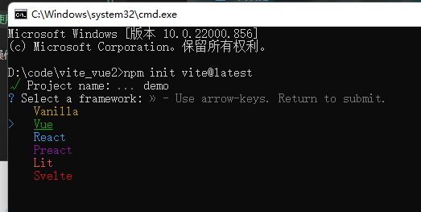
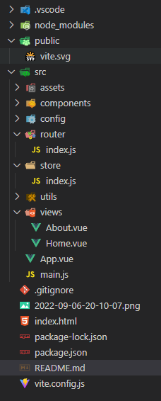

### Vite 搭建 Vue2 项目（Vue2 + vue-router + vuex）
- node 版本 -- v16.14.0
- npm 版本 -- 8.3.1
- 提示版本不要太低，否则会出现运行不起来问题！
1、创建项目
```node
npm init vite@latest
```
选择vue模板，默认会创建vue3



2、修改 package.json 文件
- 删除 vue3.0版本 + @vitejs/plugin-vue 插件
- 添加 vue2.0版本 + vite-plugin-vue2 插件
- 添加 router
- 添加 vuex


```node
  npm install vue@2
  npm install vite-plugin-vue2 -D
  npm install vue-router@3.5.1
  npm install vuex@3.6.2
```

- package.json文件内容
```json
{
  "name": "demo",
  "private": true,
  "version": "0.0.0",
  "type": "module",
  "scripts": {
    "dev": "vite",
    "build": "vite build",
    "preview": "vite preview"
  },
  "dependencies": {
    // "vue": "^3.2.37"
    "store": "^2.0.12",
    "vue-router": "^3.5.1",
    "vuex": "^3.6.2",
    "vue": "^2.7.10"
  },
  "devDependencies": {
    // "@vitejs/plugin-vue": "^3.1.0",
    "vite-plugin-vue2": "^2.0.2",
    "vite": "^3.1.0"
  }
}
```

3、添加或者修改vite.config.json文件
```js
import { createVuePlugin } from "vite-plugin-vue2";

export default {
    plugins: [createVuePlugin()],
};
```

4、修改main.js文件
```js
import Vue from 'vue';
import App from "./App.vue"
import store from './store'
import router from './router/index.js'

new Vue({
  el: '#app',
  router,
  store,
  render: (h) => h(App),
}).$mount();
```

5、修改App.vue文件
```vue
<template>
  <div>
    <nav>
      <router-link to="/">Home</router-link> |
      <router-link to="/about">About</router-link>
    </nav>
    <router-view />
  </div>
</template>
```

6、最后项目配置完成
```node
npm install 
npm run dev
```

- 文件目录

